# ENTREGA 1 – FUNDAMENTOS DE DOCKER: DEBIAN, NGINX Y NEXTCLOUD

## Descripción del Proyecto
 
Este documento detalla el proceso y los resultados de la práctica sobre los fundamentos de Docker. El objetivo es demostrar la comprensión y el manejo de contenedores, imágenes, redes y configuración a través de una serie de ejercicios prácticos divididos en dos partes (A y B).

El historial completo de comandos ejecutados durante la práctica se encuentra adjunto en el fichero `command_history.txt`.

---

## PARTE A

### 1. Instalación de Docker en Fedora 42

La evidencia muestra la verificación de la versión de Docker instalada en el sistema y la confirmación del estado del servicio `docker.service`, comprobando que se encuentra activo y en ejecución.

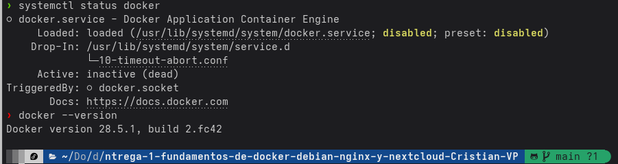

### 2. Ejecución y Gestión del Contenedor `hello-world`

La captura presenta la salida del comando `docker ps -a`, que lista todos los contenedores, incluyendo los detenidos. Se observa el contenedor `hello-world` con estado `Exited`, confirmando que completó su ejecución y se detuvo correctamente.

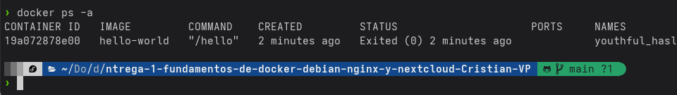

### 3. Contenedor Interactivo con Debian

Se presentan dos evidencias para este punto:

1. La primera captura muestra el proceso de instalación del paquete `nano` dentro del contenedor Debian, confirmando la capacidad de modificar su sistema de archivos.
2. La segunda captura muestra el estado `Exited` del contenedor `mi-debian` tras salir de la sesión interactiva, lo que demuestra el ciclo de vida del contenedor al finalizar su proceso principal.

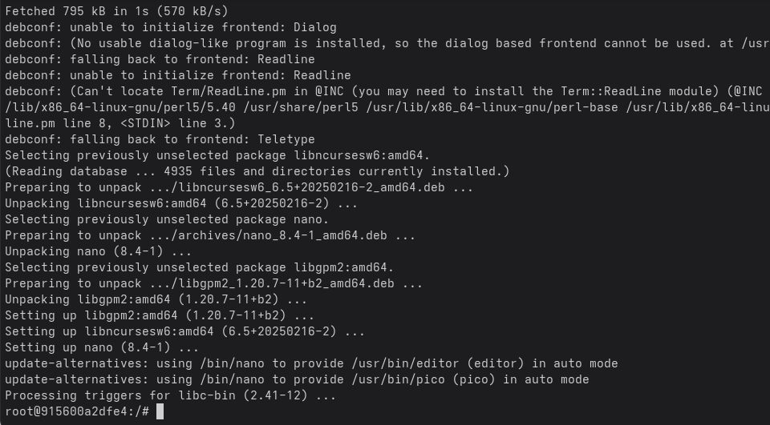

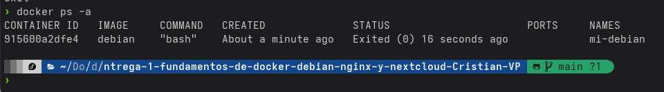

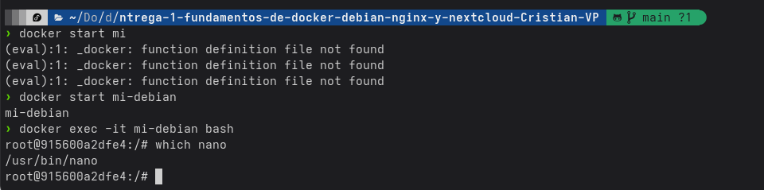

### 4. Contenedor Demonio con Nginx

Las capturas de este paso demuestran el despliegue de un servidor web Nginx:

1. La primera evidencia es la página de bienvenida de Nginx, accesible desde el navegador en `localhost:8080`, validando el correcto mapeo de puertos.
2. La segunda evidencia muestra los logs del contenedor, donde se registran las peticiones de acceso HTTP al servidor.

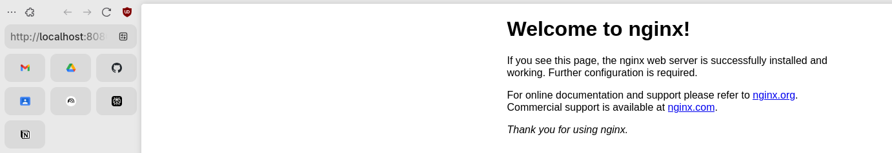

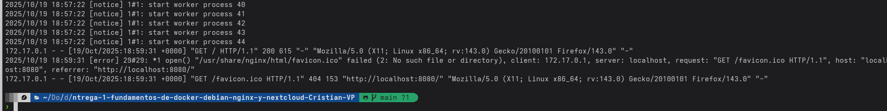

### 5. Contenedor Nextcloud con Variables de Entorno

La evidencia confirma que el contenedor `mi-nextcloud` se inició correctamente y que la variable de entorno para personalizar el nombre de la base de datos fue aplicada. Esto se verifica inspeccionando las variables del entorno del contenedor en ejecución, donde se observa `SQLITE_DATABASE=mi_base_de_datos`.

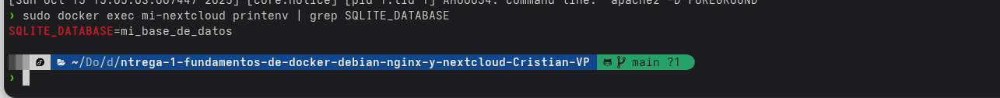

---

## PARTE B

### 1. Creación de un segundo servidor Nginx

La captura muestra la ejecución del comando para crear el contenedor `servidor_web` y la posterior verificación con `docker ps`, donde se observa el nuevo contenedor corriendo y exponiendo el puerto `8181`.

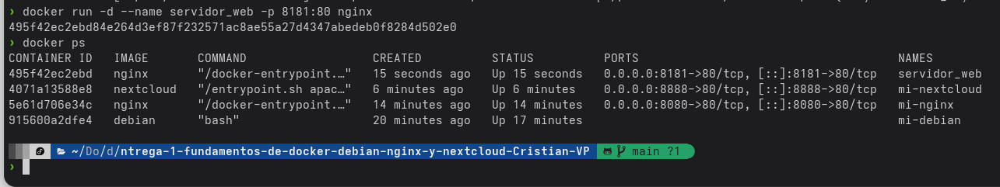

### 2. Verificación de acceso al `servidor_web`

La evidencia visual es una captura del navegador accediendo a `localhost:8181`, lo que confirma que el segundo servidor Nginx es accesible en el puerto especificado.

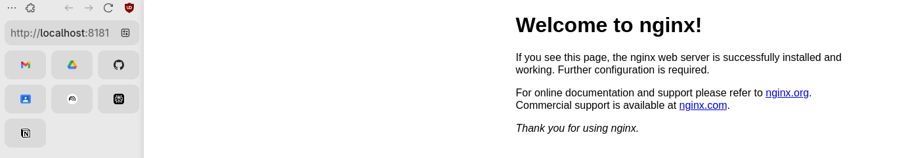

### 3. Listado de Imágenes Locales

Se presenta la salida del comando `docker images`, que realiza un inventario de todas las imágenes Docker descargadas en el sistema local durante el transcurso de la práctica.

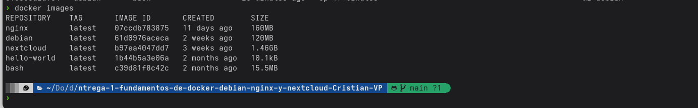

### 4. Detención y Eliminación del Contenedor

La captura de terminal documenta la secuencia de comandos para detener (`docker stop`) y eliminar (`docker rm`) el contenedor `servidor_web`, finalizando con una comprobación que confirma su correcta eliminación del sistema.

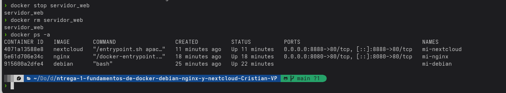
